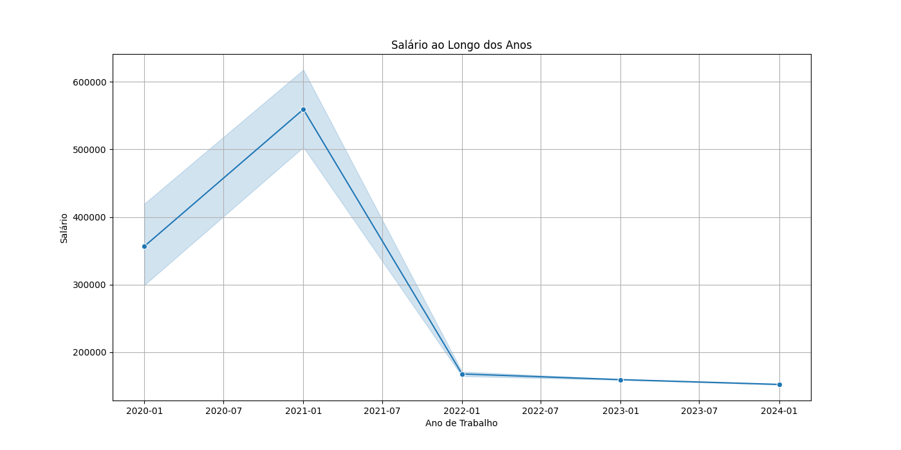
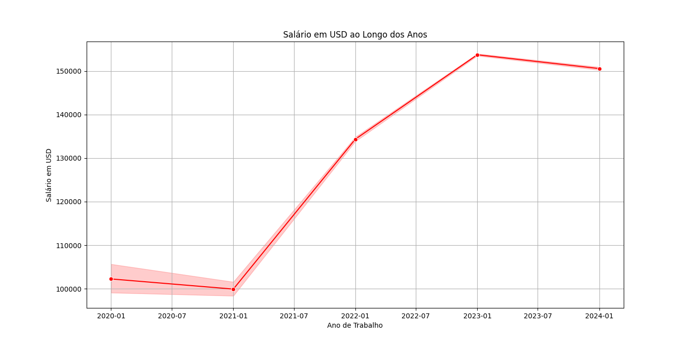
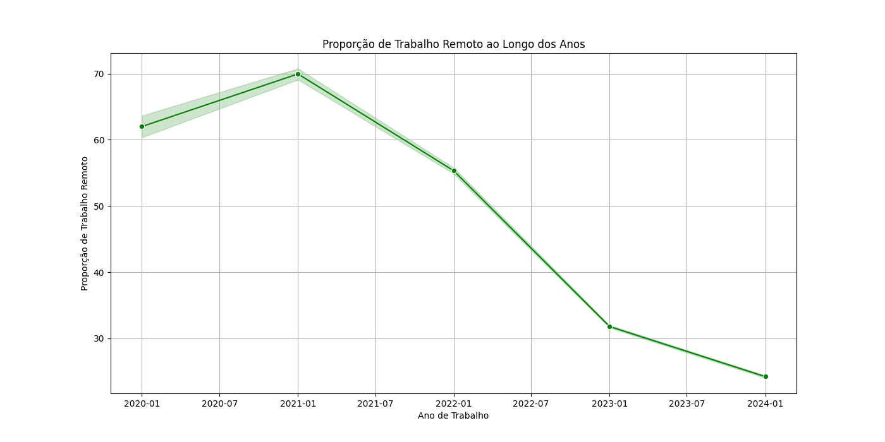
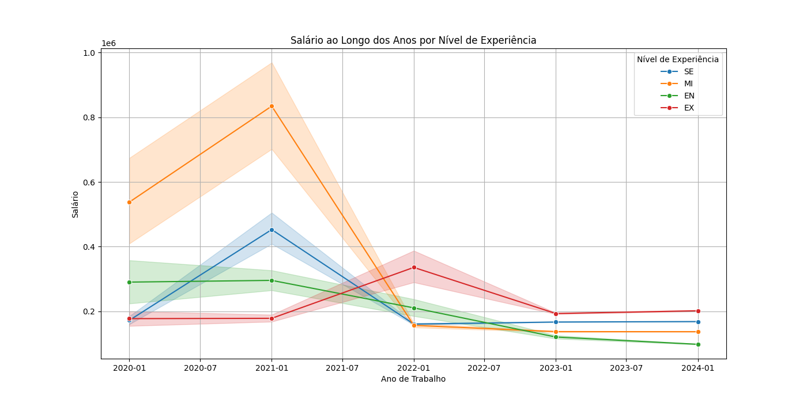
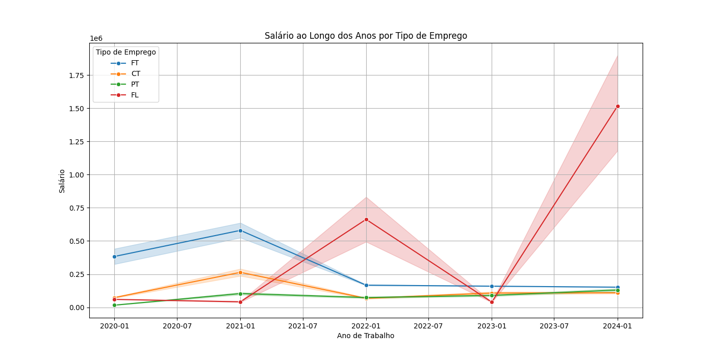

## Projeto para analisar salários de desenvolvedor na área de dados.

## *Análise Descritiva*

### As tecnologias utilizadas foram: 
* Python 
* SQL 
* PostgrSQL 
* PgAdmin 4
### Bibliotecas utilizadas:
* Psycopg2 
* Pandas
* Seaborn
* Matplotlib 

### Passo a passo de uma analise descritiva.
* Criação dos banco de dados com PgAdmin 4, conectar ele com o código em Python.
* Conexão feita com o banco de dados. 
* Criação das tabelas com código Python.
* Leitura dos dados do CSV. 
* Formatação da coluna data. 
* Inserir os dados na tabela em cada coluna designada. 

### Estatisticas descritivas adicionais para as colunas específicas 
* Média de salário: $163726.96
* Mediana de salário: $142200.0
* Desvio padrão de salário: $340195.79
* Valor mínimo de salário: $14000.0
* Valor máximo de salário: $30400000.0
* Primeiro quartil de salário: $101763.0
* Terceiro quartil de salário: $187200.0
* Moda de salário: $150000.0

### Feita a criação de gráficos em linhas para demonstrar a análise descritiva.

